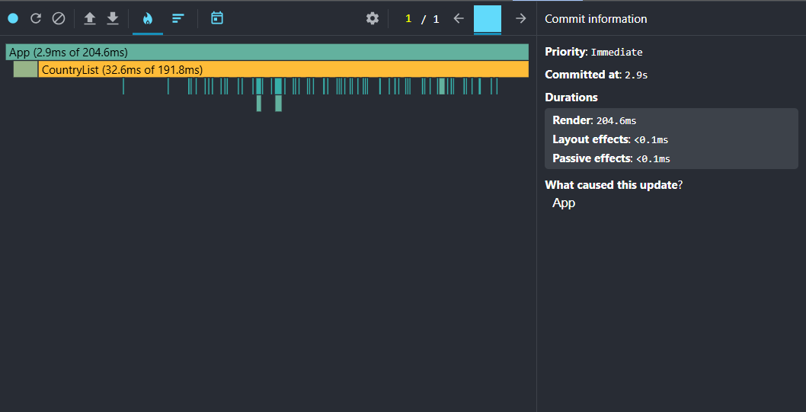
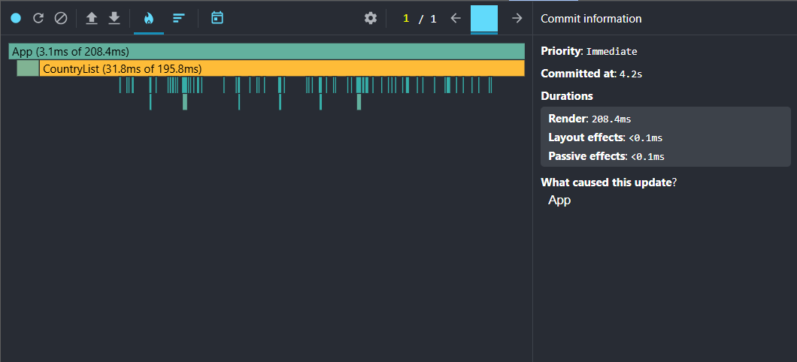
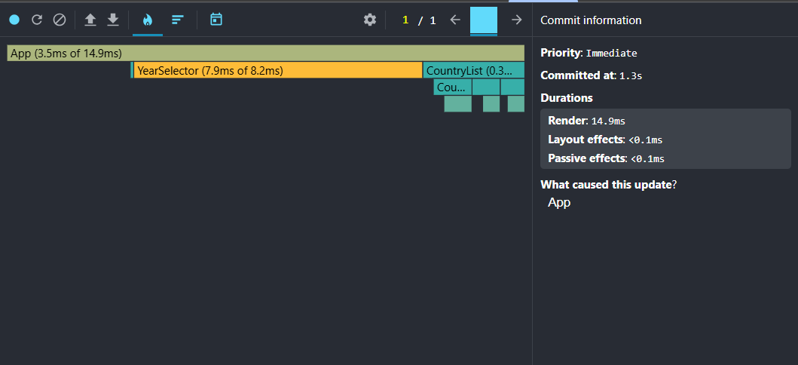
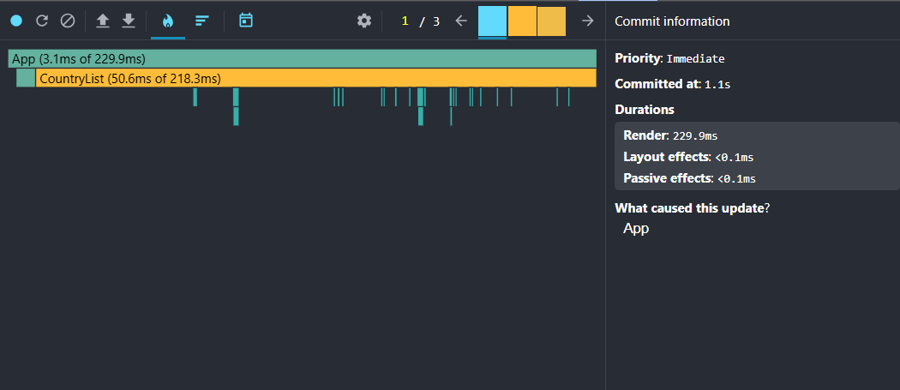
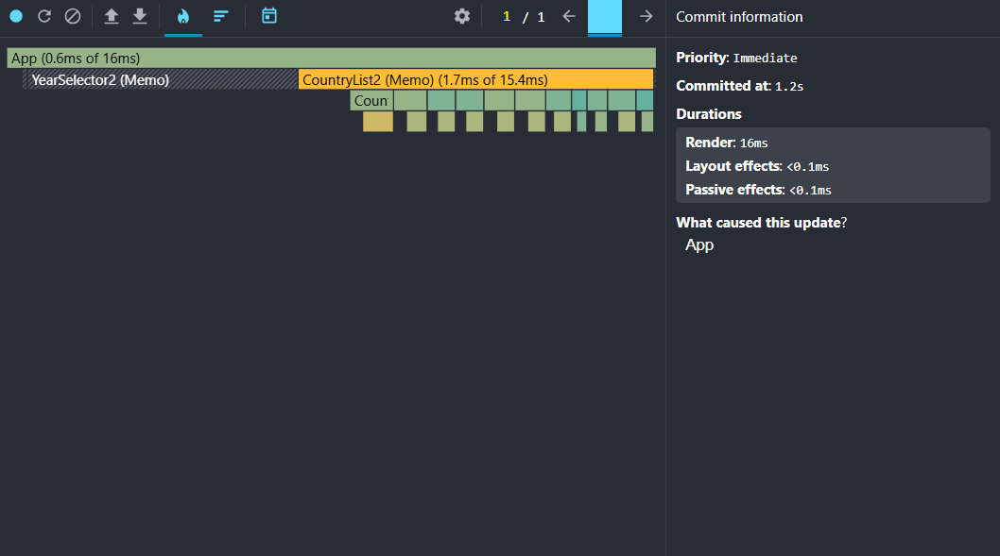
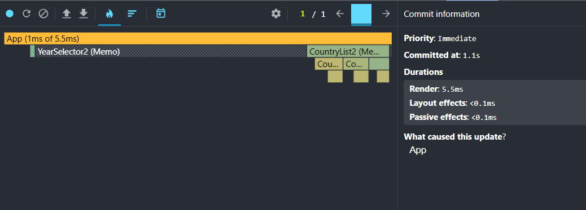
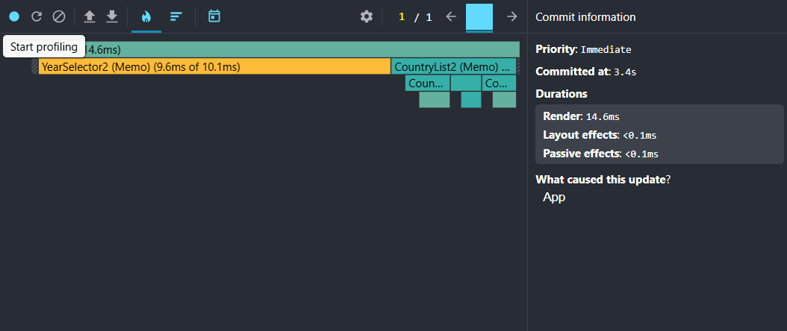
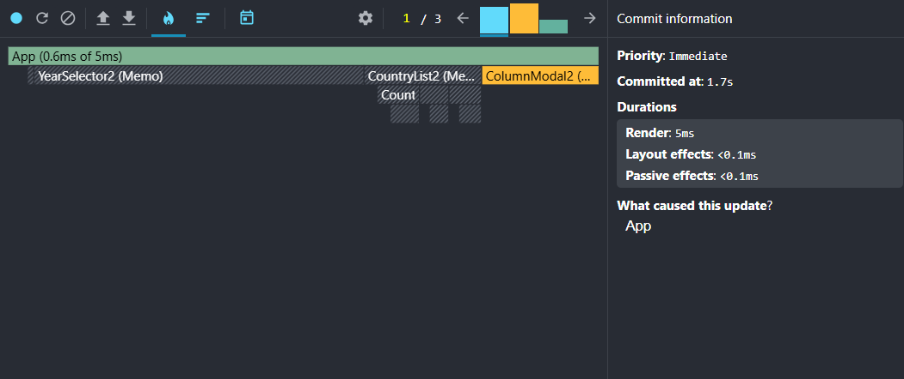

# Performance Optimization Report

## Environment

- Application mode: development
- Browser: Chrome
- Profiler: React DevTools Profiler
- Dataset: OWID CO2 emissions data
- Profiling dates: 2026-06-14 and 2026-06-15

## Baseline Measurements

### Interaction A: Sort countries

- Action: changed country sort order / sort field
- Commit duration: 198.8 ms
- Render duration: 198.8 ms
- Flame chart screenshot: 
- Profiler export: [baseline-sort.json](performance-starter/schemas/baseline/baseline-sort.json)

### Interaction B: Search countries

- Action: typed `United` in the country search input
- Commit duration: 208.0 ms
- Render duration: 208.0 ms
- Flame chart screenshot: 
- Profiler export: [baseline-search.json](performance-starter/schemas/baseline/baseline-search.json)

### Interaction C: Change year

- Action: selected a different year in the year selector
- Commit duration: 15.0 ms
- Render duration: 15.0 ms
- Flame chart screenshot: 
- Profiler export: [baseline-change-year.json](performance-starter/schemas/baseline/baseline-change-year.json)

### Interaction D: Toggle column

- Action: opened the column modal, toggled one column, and closed the modal
- Commit duration: 586.9 ms total across 3 commits
- Render duration: 586.9 ms total across 3 commits
- Flame chart screenshot: 
- Profiler export: [baseline-toggle-column.json](performance-starter/schemas/baseline/baseline-toggle-column.json)

## Identified Bottlenecks

- Country filtering and sorting were recalculated on every render.
- Population lookup created year maps repeatedly during sorting.
- Country cards and data tables re-rendered even when their props did not meaningfully change.
- List rendering used index keys, which are unstable for filtering and sorting.
- The full country list was rendered at once without virtualization.

## Applied Optimizations

- Used `useMemo` for available years, available columns, normalized search text, country year maps, filtered and sorted countries, and selected-year records.
- Used `useCallback` for event handlers passed to child components.
- Used `React.memo` for pure child components: country list, country card, data table, search bar, year selector, and column modal.
- Replaced index keys with stable semantic keys.
- Implemented fixed-height virtualization for the country list with overscan.

## Optimized Measurements

### Interaction A: Sort countries

- Action: changed country sort order / sort field
- Commit duration: 13.8 ms
- Render duration: 13.8 ms
- Flame chart screenshot: 
- Profiler export: [optimized-sort.json](performance-starter/schemas/optimized/optimized-sort.json)

### Interaction B: Search countries

- Action: typed `United` in the country search input
- Commit duration: 6.3 ms
- Render duration: 6.3 ms
- Flame chart screenshot: 
- Profiler export: [optimized-search.json](performance-starter/schemas/optimized/optimized-search.json)

### Interaction C: Change year

- Action: selected a different year in the year selector
- Commit duration: 14.2 ms
- Render duration: 14.2 ms
- Flame chart screenshot: 
- Profiler export: [optimized-change-year.json](performance-starter/schemas/optimized/optimized-change-year.json)

### Interaction D: Toggle column

- Action: opened the column modal, toggled one column, and closed the modal
- Commit duration: 19.8 ms total across 3 commits
- Render duration: 19.8 ms total across 3 commits
- Flame chart screenshot: 
- Profiler export: [optimized-toggle-column.json](performance-starter/schemas/optimized/optimized-toggle-column.json)

Profiler export note: duration values were taken from React DevTools Profiler `commitData`.
For single-commit interactions, the selected commit duration is reported. For column toggling,
which records opening the modal, toggling a column, and closing the modal, total duration across all
3 commits is reported.

## Summary of Improvements

### Render duration

| Interaction | Baseline | Optimized | Improvement |
| --- | ---: | ---: | ---: |
| Sort countries | 198.8 ms | 13.8 ms | 93.1% |
| Search countries | 208.0 ms | 6.3 ms | 97.0% |
| Change year | 15.0 ms | 14.2 ms | 5.3% |
| Toggle column | 586.9 ms | 19.8 ms | 96.6% |
| **Average** | **252.2 ms** | **13.5 ms** | **94.6%** |

### Commit duration

| Interaction | Baseline | Optimized | Improvement |
| --- | ---: | ---: | ---: |
| Sort countries | 198.8 ms | 13.8 ms | 93.1% |
| Search countries | 208.0 ms | 6.3 ms | 97.0% |
| Change year | 15.0 ms | 14.2 ms | 5.3% |
| Toggle column | 586.9 ms | 19.8 ms | 96.6% |
| **Average** | **252.2 ms** | **13.5 ms** | **94.6%** |

## Validation

- Branch: `performance`
- React Compiler: not used
- `react-scan`: installed for diagnostics, disabled in `src/main.tsx`
- `npm run lint`: passed
- `npm run build`: passed
